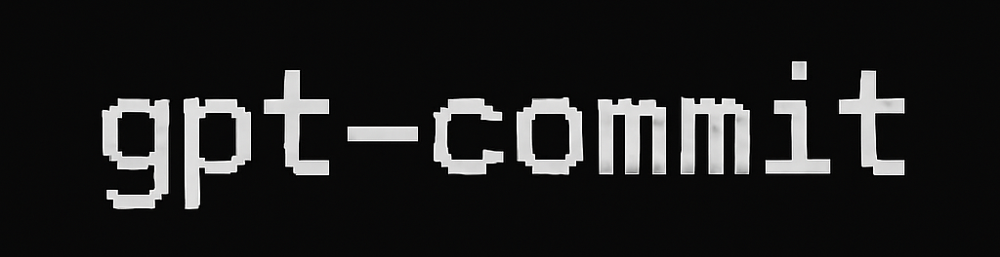

<p align="center">
  
</p>

<h1 align="center">gpt-commit</h1>

<p align="center">🚀 Automatically generate Git commit messages using GPT (OpenAI) or local models via Ollama.</p>

<p align="center">
  <a href="https://pypi.org/project/gpt-commit/"></a>
  
  
  
  
</p>

## ✨ Features
- Uses `git diff --cached` to summarize staged changes
- Works with OpenAI GPT models (gpt-3.5-turbo, gpt-4)
- Supports local LLMs via [Ollama](https://ollama.com/)
- CLI tool: simple, fast, dev-friendly

## 📦 Installation

### From PyPI
```bash
pip install gpt-commit
```

### From Source
```bash
git clone https://github.com/yourusername/gpt-commit.git
cd gpt-commit
pip install -e .
```

## 🔧 Setup

### OpenAI Backend
1. Get your API key from [OpenAI](https://platform.openai.com/api-keys)
2. Set the environment variable:
   ```bash
   export OPENAI_API_KEY='your-api-key'
   ```
   Or create a `.env` file in your project root:
   ```
   OPENAI_API_KEY=your-api-key
   ```

### Ollama Backend
1. Install [Ollama](https://ollama.com/)
2. Pull a model (e.g., CodeLlama):
   ```bash
   ollama pull codellama
   ```

## 🚀 Usage

1. Stage your changes:
   ```bash
   git add .
   ```

2. Generate a commit message:
   ```bash
   # Using OpenAI (default)
   gpt-commit --backend openai --model gpt-4

   # Using Ollama
   gpt-commit --backend ollama --model codellama

   # Auto-commit with the generated message
   gpt-commit --commit
   ```l

## 🔍 Options
- `--backend`: Choose between 'openai' or 'ollama' (default: 'ollama')
- `--model`: Specify the model name (default: 'gpt-4' for OpenAI, 'codellama' for Ollama)
- `--commit`: Automatically commit with the generated message

## 🤝 Contributing
Contributions are welcome! Please feel free to submit a Pull Request.

## 📝 License
This project is licensed under the MIT License - see the [LICENSE](LICENSE) file for details.
